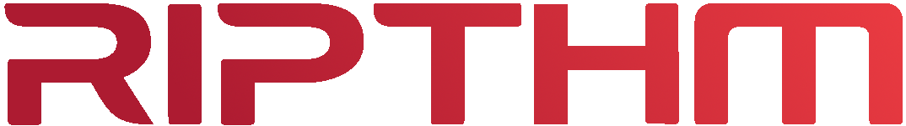

<p align="center">
  
</p>
<div align="center">

   <a href=""></a>
   <a href=""></a>
   <a href=""></a>
   <a href=""></a>
   <br>
   <a href=""></a>
   <a href=""></a>
   <a href=""></a>
</div>

# RipthmV2

<br>RipthmV2 is a feature-rich Discord music bot built using Python. It leverages the Lavalink audio streaming library to provide high-quality music playback and includes advanced features such as Spotify integration, lyrics fetching, custom audio filters and sponsorblock integration. Find the links to invite the bot here, I can't promise the bots will be online 24/7, if not see below on how to host it youself!

## Invite Links

[Add RIPthm here](https://discord.com/oauth2/authorize?client_id=887006229195542598)<br>
[Add RIPthm 2 here](https://discord.com/oauth2/authorize?client_id=888547452515409950&permissions=277062412608&scope=applications.commands+bot)

## Features

- **Music Playback**: Play music from YouTube, Spotify, SoundCloud, and more.
- **Queue Management**: Add, remove, shuffle, and loop songs in the queue.
- **Audio Filters**: Apply filters like nightcore, vaporwave, karaoke, and lowpass.
- **Lyrics Integration**: Fetch song lyrics using the Genius API.
- **SponsorBlock (Ad block) Integration**: Automatically skip non-music (sponsorships, etc.) segments in YouTube videos.
- **Admin Commands**: Manage bot cogs, restart, update, and view logs.
- **Customizable**: Easily configure the bot using environment variables.

## Requirements

- Python 3.8 or higher
- Lavalink server
- Discord bot token
- Spotify API credentials (optional for Spotify features)
- Genius API token (optional for lyrics)

## Installation

1. Clone the repository:
   ```bash
   git clone https://github.com/BEMZ01/Ripthm-V2
   cd Ripthm-V2
   ```
   
2. Create and activate a virtual environment:
   ```bash
   python -m venv venv
   source venv/bin/activate  # On Windows: venv\Scripts\activate
    ```
3. Install the required dependencies:
   ```bash
   python -m pip install --upgrade pip
   python -m pip install -r requirements.txt
    ```
4. Configure the `.env` file:
   - Copy `.env.example` to `.env`.
   - Fill in the required values (e.g., `DISCORD_TOKEN`, `LAVA_ADDR`, etc.).

5. Start the bot:
   ```bash
   ./start.sh /path/to/RipthmV2
    ```
## Useage
- Use /play to play a song or add it to the queue.
- Use /queue to view the current queue.
- Use /pause, /resume, /skip, and /stop to control playback.
- Use /lyrics to fetch the lyrics of the current song.
- Use /filters to apply audio effects like nightcore or vaporwave.
### Admin Commands
- /admin load <cog>: Load a cog.
- /admin unload <cog>: Unload a cog.
- /admin reload <cog>: Reload a cog.
- /admin reloadall: Reload all cogs.
- /admin shutdown: Shut down the bot.
- /admin restart: Restart the bot.
- /admin update: Update the bot from the repository.
## Contributing
Contributions are welcome! Feel free to open issues or submit pull requests to improve the bot.

## License
This project is licensed under the MIT License. See the [LICENSE](LICENSE) file for details.

## Acknowledgments
- Lavalink for audio streaming.
- Pycord for the Discord API wrapper.
- Spotipy for Spotify integration.
- Genius API for lyrics fetching.
